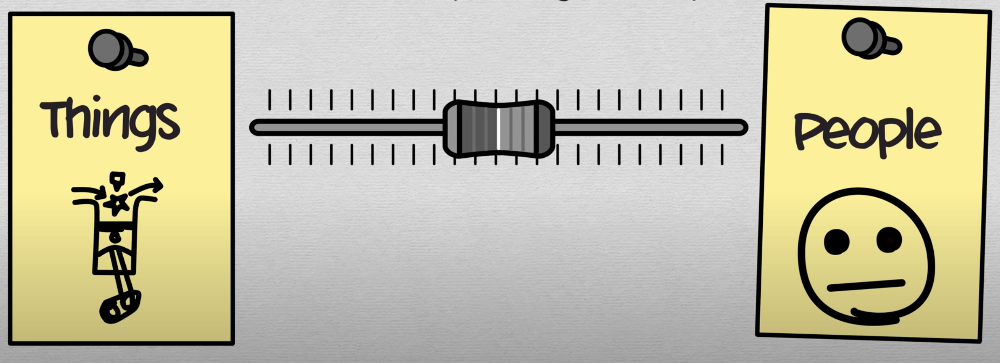

- More women are interested in `people` than `things`
	- converse it true for men.
	- {:height 162, :width 420}
	- This is generally applicable to [[Homo Sapiens]] but is not always the case.
- [[Overlapping Distribution]]
	- Distribution of height among male and female
		- {:height 271, :width 433}
	- Distribution of [[Agreeableness]]
		- .jpg){:height 347, :width 436}
	-
	- To understand characteristic difference between men and women, one must understand the distribution difference them.
	- Why are the most despicable crimes done by men?
		- Some observable effects takes places in the ends of these distributions. Therefore when looking at the overlapping distribution of female's and male's characteristic; you would find the extremes to be heavily biased.